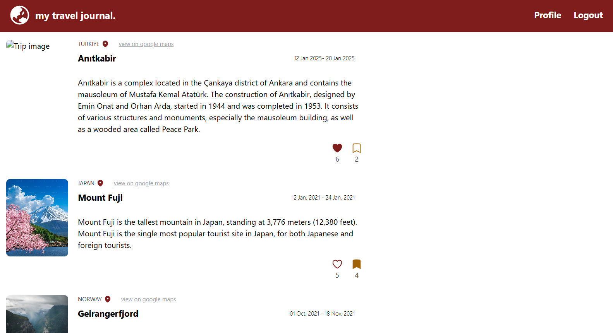
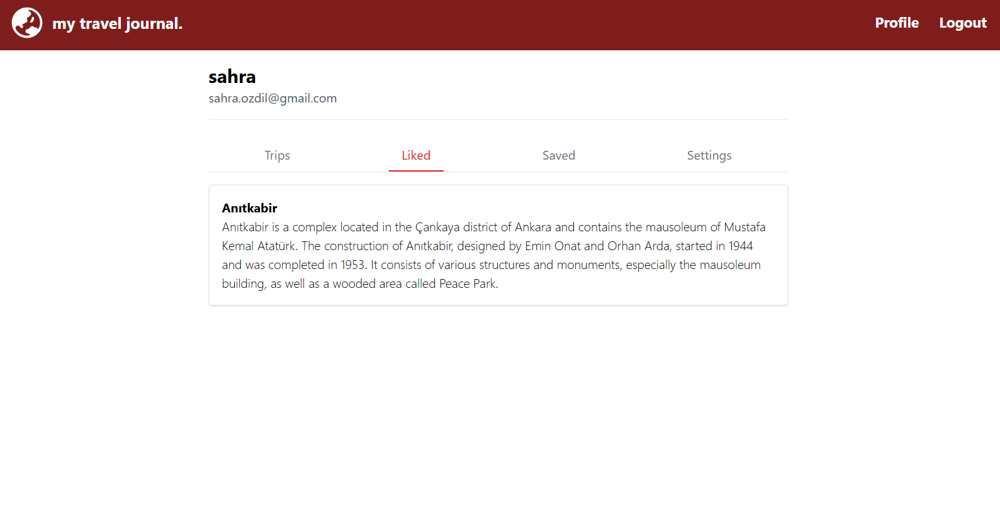
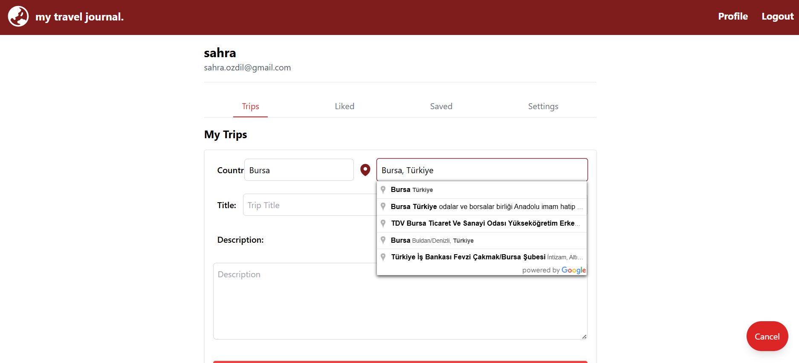

# Travel Journey

**Travel Journey** is a dynamic React application where users can share and explore travel experiences from around the world. This app allows you to document your adventures, save memorable trips, and interact with other users by liking their stories.

---

## Features

- **Share Your Journey**: Create and post your travel experiences with photos and descriptions.  
- **Explore Trips**: Browse trips shared by other users and discover new destinations.  
- **Like and Save**: Show appreciation by liking posts and save your favorite trips for future reference.  
- **Profile Page**: View your liked and saved trips in your profile.  
- **Location-Based Posts**: Tag posts with location for easier discovery.  
- **Real-Time Updates**: Like and save counts update instantly without refreshing the page.

---

## How to Use

1. **View Trips**: Start by exploring existing travel posts on the home page.  
2. **Like or Save**: Click the like or save button on a post to interact with it.  
3. **Add Your Journey**: Share your own travel story through the "Add Journey" form.  
4. **Profile Page**: Access your saved or liked trips in your profile for later reference.  

---

## Installation

1. **Clone the repository**:

```bash
git clone
```

2. **Navigate to the project directory**:

```bash
cd Travel-Journey
```

3. **Install dependencies**:

```bash
npm install
```

4. **Run the development server**:

```bash
npm start
```

5. **Build the project for production**:

```bash
npm run build
```


## Previews
Home Page

Profile Page

Add Journey Form


## Additional Notes

Make sure to set up your Firebase configuration in the firebase.js file inside the src/config folder.

The project uses:

-React

-Tailwind CSS

-React Router

-Firebase (Authentication, Firestore)

-Heroicons

-Google Maps API (for location tagging)
